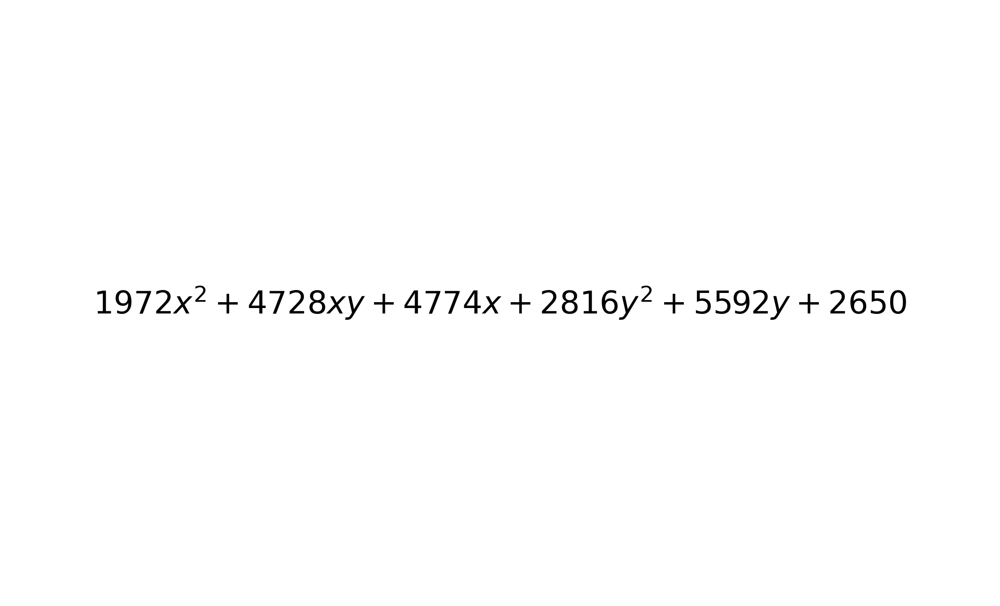

#因式分解题目生成器

## 目录
-   [Overview](#overview)
-   [Features](#features)
-   [Installation](#installation)
-   [Requirements](#requirements)
-   [Usage](#usage)
-   [Screenshots](#screenshots)
-   [Contribution](#contribution)
-   [License](#license)

## Overview

PS:这是我第一个用中文写的项目，请各位多多支持！
因式分解题目生成器，用于生成n元m次多项式，自动保存txt文本和png图像，全代码公开！可以点击查看答案，同样自动保存txt文本和png图像。超级好玩，难度多样，欢迎各位来玩。

## 📊 GitHub 统计

## 🐍 GitHub 贡献蛇动画

## 👀 主页浏览量

## Features
难度系统：
difficulty_levels = {
    "非常简单": (1, 2),
    "很简单": (3, 5),
    "简单": (6, 10),
    "一般": (11, 100),
    "困难": (101, 1000),
    "非常难": (1001, 10000),
    "噩梦": (10001, 100000),
    "地狱": (100001, 1000000)
}

## Installation
直接打开python文本就行。
    

## Requirements
我电脑里python3.12的requirements，呵呵

## Screenshots

## Contribution

感谢ChatGPT帮忙，我一个人肯定搞不好。

## License

随便写的证书。
